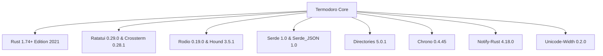
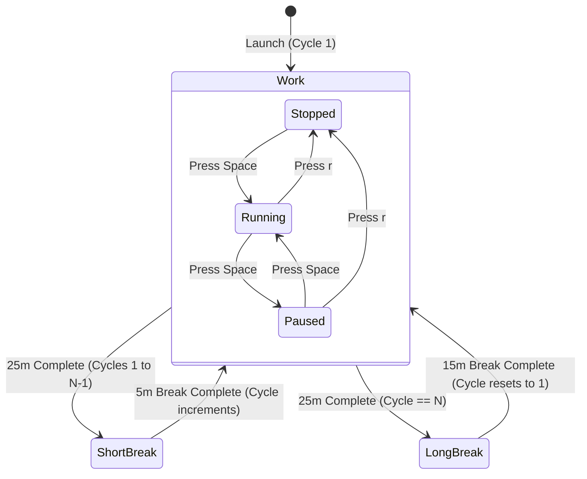
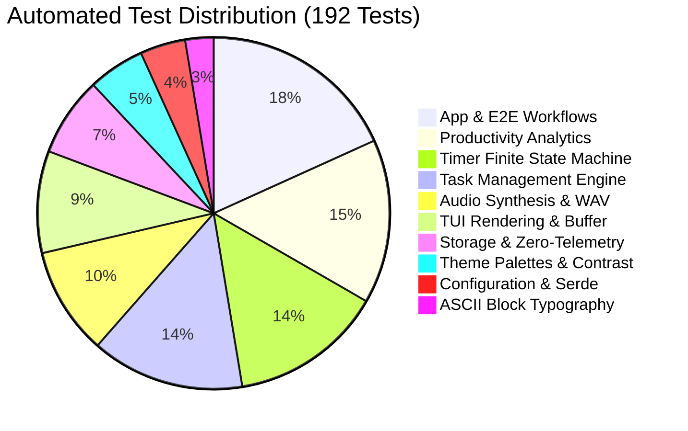

# Termodoro System Design Document

This document provides a comprehensive architectural and systems engineering specification for **Termodoro**, a terminal-native Pomodoro productivity timer, task lifecycle coordinator, and streak analytics platform written in pure Safe Rust.

---

## Table of Contents

1. [Executive Overview & Design Philosophy](#1-executive-overview--design-philosophy)
2. [Technology Stack & Architectural Rationale](#2-technology-stack--architectural-rationale)
   - [Technology Matrix & Selection Rationale](#technology-matrix--selection-rationale)
3. [System Architecture & Component Decomposition](#3-system-architecture--component-decomposition)
   - [High-Level Architectural Diagram](#high-level-architectural-diagram)
   - [Core Module Responsibilities](#core-module-responsibilities)
4. [State Machine Design & Lifecycle Flow](#4-state-machine-design--lifecycle-flow)
   - [Pomodoro Finite State Machine (FSM)](#pomodoro-finite-state-machine-fsm)
   - [Phase Transition Logic & 24-Cycle Progression](#phase-transition-logic--24-cycle-progression)
5. [User Interface & Immediate-Mode Layout Engine](#5-user-interface--immediate-mode-layout-engine)
   - [Immediate-Mode Rendering Flow](#immediate-mode-rendering-flow)
   - [Big Digits Block Rasterization](#big-digits-block-rasterization)
   - [Responsive Geometry & Adaptive Constraints](#responsive-geometry--adaptive-constraints)
6. [Data Storage, Schema & Zero-Telemetry Invariants](#6-data-storage-schema--zero-telemetry-invariants)
   - [Local JSON Storage Schema](#local-json-storage-schema)
   - [Atomic Disk Persistence Pattern](#atomic-disk-persistence-pattern)
   - [Zero-Telemetry & Air-Gapped Privacy Invariant](#zero-telemetry--air-gapped-privacy-invariant)
7. [Audio Synthesis & Signal Processing Subsystem](#7-audio-synthesis--signal-processing-subsystem)
   - [In-Memory PCM RIFF WAV Generation](#in-memory-pcm-riff-wav-generation)
   - [Audio Chime Harmonic Algorithms](#audio-chime-harmonic-algorithms)
   - [Hardware Click Prevention & Envelope Decay](#hardware-click-prevention--envelope-decay)
8. [Cross-Platform Portability Subsystem](#8-cross-platform-portability-subsystem)
9. [Terminal State Preservation & Panic Safety](#9-terminal-state-preservation--panic-safety)
10. [Automated Quality Assurance & Verification Matrix](#10-automated-quality-assurance--verification-matrix)

---

## 1. Executive Overview & Design Philosophy

Termodoro is engineered from the ground up to be an **ultra-lightweight, zero-latency, offline-first terminal productivity workstation**. It rejects modern GUI bloat (Electron, WebViews, browser processes, network analytics daemon) in favor of a single statically linked binary with instantaneous startup ($< 10\text{ms}$), minimal memory footprint ($< 15\text{MB}$ RAM), and 100% deterministic local behavior.

### Core Design Principles
1. **Zero Unsafe Rust**: The entire application compiles with `0` `unsafe` blocks, guaranteeing memory safety, borrow-checker proofs, and freedom from undefined behavior.
2. **Deterministic Offline Execution**: Air-gapped design. Zero network dependencies, zero telemetry, zero analytics tracking, zero cloud accounts, zero HTTP clients.
3. **Pure Mathematical Audio Synthesis**: Acoustic alerts are synthesized algorithmically in memory at runtime into valid 16-bit PCM RIFF WAV buffers. No external audio assets or binary sound assets bundled or read from disk.
4. **Immediate-Mode Visual Consistency**: TUI rendering is completely decoupled from state mutation, operating at 10 FPS (100ms tick event loop) with zero visual tearing, flicker, or layout corruption across any terminal dimension from $20\times 10$ to $300\times 100$.
5. **Cross-Platform Parity**: Full feature parity across Linux, macOS, and Windows with OS-specific audio and storage path resolution.

---

## 2. Technology Stack & Architectural Rationale

Termodoro intentionally limits external dependencies to a strictly audited set of robust, pure Rust crates:



### Technology Matrix & Selection Rationale

| Layer / Subsystem | Crate / Framework | Version | Purpose | Architectural Rationale & Why Chosen |
| :--- | :--- | :---: | :--- | :--- |
| **Language** | **Rust** | `2021` | Core systems language | High-performance compiled machine code, compile-time memory safety, zero garbage collection overhead, rich pattern matching. |
| **TUI Renderer** | **`ratatui`** | `0.29.0` | Immediate-mode UI layout & widgets | Standard modern Rust TUI library (fork of tui-rs) with rich constraint-based layout engine (`Flex`, `Constraint`, `Layout`), modular widgets (Tabs, Tables, Gauges, Paragraphs), and high-performance terminal diff buffer rendering. |
| **Terminal Backend** | **`crossterm`** | `0.28.1` | Terminal escape codes & raw mode | Pure cross-platform terminal abstraction supporting raw mode, alternate screen buffers, mouse/keyboard polling, ANSI TrueColor (24-bit RGB), and Windows Console Virtual Terminal sequences. |
| **Audio Playback** | **`rodio`** | `0.19.0` | Multi-OS audio output stream | Non-blocking cross-platform audio playback pipeline backed by `cpal`. Spawns background worker threads using native OS audio drivers (ALSA on Linux, CoreAudio on macOS, WASAPI on Windows). |
| **WAV Serialization** | **`hound`** | `3.5.1` | RIFF WAV header encoding | Zero-dependency, pure-Rust WAV header serialization engine. Used to wrap in-memory synthesized PCM sample vectors into standard RFC 2361 RIFF byte buffers wrapped in `std::io::Cursor`. |
| **Data Serialization** | **`serde`** / **`serde_json`** | `1.0` | JSON persistence & configuration | Industry-standard zero-copy serialization framework. Enables human-readable, portable `data.json` storage with robust fallback on corrupted or partial schema formats. |
| **OS Paths** | **`directories`** | `5.0.1` | Cross-platform standard directories | Adheres strictly to XDG Base Directory specification on Linux (`~/.local/share`), Standard Application Support on macOS, and `%APPDATA%` on Windows. |
| **Time & Analytics** | **`chrono`** | `0.4.45` | Datetime arithmetic & ISO strings | Reliable date/time manipulation, leap year calculations, calendar day streak continuities, and ISO 8601 UTC timestamps. |
| **Notifications** | **`notify-rust`** | `4.18.0` | Desktop system alert notifications | Native desktop notification triggers via Linux D-Bus / Desktop Portal, macOS notification center, and Windows toast subsystem. |
| **Unicode Layout** | **`unicode-width`** | `0.2.0` | Accurate cell-width metrics | Correctly measures single-width vs wide double-width (2-column) Unicode emoji glyphs (`🎯`, `🍅`, `🚀`), preventing text overlap and table misalignment. |

---

## 3. System Architecture & Component Decomposition

### High-Level Architectural Diagram

```
┌─────────────────────────────────────────────────────────────────────────────┐
│                           main.rs (Runtime Root)                           │
│  - Terminal Initialization (Raw Mode, Alternate Screen, Panic Hook)         │
│  - 100ms Event Loop (Crossterm Event Poller + Tick Interval Dispatcher)     │
└──────────────────────────────────────┬──────────────────────────────────────┘
                                       │ Keystrokes & Timer Ticks
                                       ▼
┌─────────────────────────────────────────────────────────────────────────────┐
│                               app.rs (App State)                            │
│  - Active Tab (Timer, Tasks, Stats, Settings)                               │
│  - Modal State (Task Modal, Help Popup)                                     │
│  - Global Event Dispatcher & Navigation Manager                             │
└──────────────┬───────────────────────┬──────────────────────┬───────────────┘
               │                       │                      │
               ▼                       ▼                      ▼
┌─────────────────────────┐ ┌────────────────────┐ ┌──────────────────────────┐
│  timer.rs (Timer Engine)│ │tasks.rs (Task Mgr) │ │  stats.rs (Analytics)    │
│  - FSM State Machine    │ │- Task Model & UUID │ │- Session History Log     │
│  - 24-Cycle Counter     │ │- Filter Predicates │ │- Daily Streaks (Leap Yr) │
│  - Duration Formatting  │ │- Active Task Target│ │- 7-Day Window Analytics  │
└──────────────┬──────────┘ └──────────┬─────────┘ └──────────┬───────────────┘
               │                       │                      │
               └───────────────────────┼──────────────────────┘
                                       │
                                       ▼
┌─────────────────────────────────────────────────────────────────────────────┐
│                            storage.rs (Persistence)                         │
│  - Atomic Save / Load via XDG Standard Directory Paths                      │
│  - Zero-Telemetry Air-Gapped Local JSON Storage                             │
└──────────────────────────────────────┬──────────────────────────────────────┘
                                       │
                                       ▼
┌─────────────────────────────────────────────────────────────────────────────┐
│                                ui/ (TUI Layer)                              │
│  - mod.rs (Root Frame Coordinator, Header, Tabs, Footer, Modals)            │
│  - digits.rs (5x3 Digital Clock ASCII Block Rasterizer)                     │
│  - timer_view.rs, tasks_view.rs, stats_view.rs, settings_view.rs            │
│  - theme.rs (18 Concrete 24-Bit RGB Palettes)                               │
└─────────────────────────────────────────────────────────────────────────────┘
```

### Core Module Responsibilities

1. **`src/main.rs`**: Entry point. Sets up panic hooks to protect terminal raw mode, initializes `crossterm::terminal`, loads persistent state from `Storage`, and drives the 100ms tick / event loop.
2. **`src/app.rs`**: The central state coordinator. Holds instances of `Timer`, `TaskManager`, `StatsTracker`, `AppConfig`, and active UI views. Dispatches keyboard events and handles modal inputs.
3. **`src/timer.rs`**: Implements the Pomodoro state machine with 24-cycle advancement, sub-second tick calculation, pause/resume/reset mechanics, and phase completion signals.
4. **`src/tasks.rs`**: Task data model. Manages unique UUID creation, title sanitization, pomodoro estimates vs spent counters, filter states (`All`, `Active`, `Completed`), and target binding.
5. **`src/stats.rs`**: Analytics processor. Aggregates focus minutes, records completed sessions, computes consecutive calendar day streaks across month/year/leap-year boundaries, and formats 7-day distribution histograms.
6. **`src/config.rs`**: User configuration model. Encapsulates session durations (Work, Short Break, Long Break), Long Break intervals ($1 \le N \le 24$), audio/notification toggles, auto-start flags, and theme choices.
7. **`src/theme.rs`**: Visual styling engine. Provides 18 handcrafted 24-bit RGB color themes with high WCAG luminance contrast.
8. **`src/audio.rs`**: Synthesizes pure 16-bit PCM WAV audio buffers algorithmically and dispatches non-blocking playback streams via `rodio`.
9. **`src/storage.rs`**: Manages filesystem I/O, resolving platform-specific data directories and guaranteeing atomic save operations with corrupt-file recovery.
10. **`src/ui/`**: Immediate-mode presentation layer rendering screens and modals on every frame.

---

## 4. State Machine Design & Lifecycle Flow

### Pomodoro Finite State Machine (FSM)

The timer operates according to a strict three-phase finite state machine with support for 24-cycle progressions:



### Phase Transition Logic & 24-Cycle Progression
- **Work Phase**: Increments the active task's `pomodoros_spent` counter upon completion, plays the 528 Hz Zen chime, logs focus minutes to `StatsTracker`, and increments daily focus statistics.
- **Short Break Trigger**: When current `cycle < long_break_interval` ($1 \le \text{interval} \le 24$), the next phase is set to `ShortBreak`.
- **Long Break Trigger**: When current `cycle == long_break_interval`, the next phase transitions to `LongBreak`, after which the cycle counter wraps cleanly back to `1`.
- **Auto-Start Support**: If `auto_start_breaks` or `auto_start_pomodoros` are enabled in configuration, transitions immediately start countdown rather than halting in a `Stopped` state.

---

## 5. User Interface & Immediate-Mode Layout Engine

### Immediate-Mode Rendering Flow
Ratatui employs an immediate-mode rendering architecture where the entire screen is redrawn on each tick from current state:

```mermaid
sequenceDiagram
    participant Loop as Event Loop (100ms)
    participant App as App State
    participant UI as UI Coordinator (ui/mod.rs)
    participant Buffer as Terminal Double Buffer

    Loop->>App: Tick (Calculate remaining seconds)
    Loop->>UI: Terminal::draw(f, &app)
    UI->>UI: Calculate Layout Constraints (Rects)
    UI->>UI: Render Header (Tabs & Version)
    UI->>UI: Render Active Tab View (Timer/Tasks/Stats/Settings)
    UI->>UI: Render Modals (If Active)
    UI->>UI: Render Status Toast & Keybinding Footer
    UI->>Buffer: Flush Diff to Screen via Crossterm
```

### Big Digits Block Rasterization
The 5-row digital block clock on Tab 1 uses a custom ASCII rasterizer (`src/ui/digits.rs`). Each character (`0-9`, `:`) is mapped to a $5\times 3$ grid of block characters (`█` and spaces), guaranteeing bold, readable numbers that scale cleanly across any monospace terminal font.

### Responsive Geometry & Adaptive Constraints
The UI engine uses flexible constraint layouts:
- If terminal width $< 50$ columns or height $< 15$ rows, views gracefully condense margins and abbreviate labels.
- Table headers and modal dialogs dynamically compute column widths using `unicode-width` to prevent glyph truncation.

---

## 6. Data Storage, Schema & Zero-Telemetry Invariants

### Local JSON Storage Schema
User data is persisted into a single, clean JSON file (`data.json`):

```json
{
  "config": {
    "work_duration_mins": 25,
    "short_break_mins": 5,
    "long_break_mins": 15,
    "long_break_interval": 4,
    "sound_enabled": true,
    "desktop_notifications": true,
    "theme": "catppuccin_mocha",
    "auto_start_breaks": false,
    "auto_start_pomodoros": false
  },
  "tasks": [
    {
      "id": "a1b2c3d4-e5f6-7890-abcd-ef1234567890",
      "title": "Implement Feature Architecture",
      "completed": false,
      "pomodoros_spent": 3,
      "pomodoros_estimated": 4,
      "created_at": "2026-08-17T12:00:00Z"
    }
  ],
  "stats": {
    "total_focus_minutes": 75,
    "total_sessions_completed": 3,
    "current_streak_days": 5,
    "longest_streak_days": 12,
    "last_session_date": "2026-08-17",
    "history": []
  }
}
```

### Atomic Disk Persistence Pattern
To prevent data loss during sudden system shutdowns or power outages, `Storage::save()` writes to a temporary file (`data.json.tmp`) and performs an atomic filesystem rename/replace onto `data.json`.

### Zero-Telemetry & Air-Gapped Privacy Invariant
- **No Network Crates**: `Cargo.lock` contains zero networking dependencies (`reqwest`, `hyper`, `curl`, `ureq`).
- **No Third-Party SDKs**: Rejects tracking services (Sentry, PostHog, Mixpanel, Datadog).
- **Formal Invariant Tests**: Tested by `test_privacy_zero_telemetry_guarantees` and CI automated AST scanners.

---

## 7. Audio Synthesis & Signal Processing Subsystem

### In-Memory PCM RIFF WAV Generation
Rather than bundling static `.wav` files or requiring external media assets, Termodoro generates sound waves mathematically in memory at runtime:

$$\text{Sample}[t] = \sum_{k=1}^{M} A_k \cdot \sin(2\pi f_k t) \cdot e^{-\lambda t}$$

Where:
- $f_k$ represents the harmonic frequency in Hertz.
- $A_k$ is the amplitude coefficient bounded between $10,000 \le A \le 32,000$ (16-bit signed integer).
- $\lambda$ is the exponential decay factor.

```
                    Acoustic Synthesis Pipeline
  ┌─────────────────────────────────────────────────────────────┐
  │ Frequency & Harmonic Equations (e.g. 528 Hz Zen Bowl)      │
  └──────────────────────────────┬──────────────────────────────┘
                                 │ Float Sample Vector
                                 ▼
  ┌─────────────────────────────────────────────────────────────┐
  │ Exponential Amplitude Decay & Zero-Clipping Envelope Filter │
  └──────────────────────────────┬──────────────────────────────┘
                                 │ 16-Bit PCM Signed Integers
                                 ▼
  ┌─────────────────────────────────────────────────────────────┐
  │ Hound RFC 2361 RIFF WAV Header Encoder (std::io::Cursor)    │
  └──────────────────────────────┬──────────────────────────────┘
                                 │ In-Memory WAV Bytes
                                 ▼
  ┌─────────────────────────────────────────────────────────────┐
  │ Rodio Non-Blocking Audio Stream Output                      │
  └─────────────────────────────────────────────────────────────┘
```

### Audio Chime Harmonic Algorithms
1. **Focus Completion (Zen Tibetan Bowl)**: 528 Hz fundamental with subtle harmonic overtone (1056 Hz) and gentle 2.5-second exponential decay.
2. **Short Break Completion (Two-Tone Alert)**: Dual chime at 659.25 Hz ($E_5$) followed by 880.00 Hz ($A_5$).
3. **Long Break Completion (Major Triad Chord)**: Harmonious major chord comprising $C_5$ (523.25 Hz), $E_5$ (659.25 Hz), and $G_5$ (783.99 Hz).

### Hardware Click Prevention & Envelope Decay
To eliminate annoying digital pops or DAC clicks at the end of sounds, all waveforms conclude with a micro-fade decay window ensuring sample amplitude reaches exactly zero at the terminating byte.

---

## 8. Cross-Platform Portability Subsystem

Termodoro provides native operational parity across all major desktop operating systems:

| Dimension | 🐧 Linux & BSD | 🍎 macOS (Darwin) | 🪟 Windows (10 / 11) |
| :--- | :--- | :--- | :--- |
| **Storage Directory** | `~/.local/share/termodoro/` | `~/Library/Application Support/com.termodoro.termodoro/` | `C:\Users\<User>\AppData\Roaming\termodoro\termodoro\` |
| **Audio Backend** | ALSA / PulseAudio / PipeWire | CoreAudio | WASAPI / DirectSound |
| **Notifications** | D-Bus / Desktop Portal | Notification Center | WinRT Toast Notifications |
| **Terminal Mode** | ANSI escape codes | ANSI escape codes | Windows Virtual Terminal Sequences |
| **Architecture Support** | `x86_64`, `aarch64`, `armv7` | Apple Silicon (`aarch64`), Intel (`x86_64`) | `x86_64`, `aarch64` |

---

## 9. Terminal State Preservation & Panic Safety

Terminal raw mode alters terminal driver settings (disabling echo, canonical line buffering, and newline conversion). If an application panics without cleanup, the user's terminal session can become corrupted.

Termodoro implements a **Guaranteed Terminal Restore Hook** (`std::panic::set_hook`) in `src/main.rs`:

```rust
let default_panic = std::panic::take_hook();
std::panic::set_hook(Box::new(move |info| {
    // 1. Disable raw mode immediately
    let _ = crossterm::terminal::disable_raw_mode();
    // 2. Leave alternate screen buffer and restore main buffer
    let _ = crossterm::execute!(
        std::io::stdout(),
        crossterm::terminal::LeaveAlternateScreen,
        crossterm::cursor::Show
    );
    // 3. Chain back to default panic handler for clean backtrace print
    default_panic(info);
}));
```

---

## 10. Automated Quality Assurance & Verification Matrix

Termodoro's architecture is continuously certified by a comprehensive **192-test automated QA harness** running across Linux, macOS, and Windows:



| Verification Dimension | Verified Standard | Verification Tool | Status |
| :--- | :--- | :--- | :---: |
| **Compiler Compliance** | Rust 1.74+ (Edition 2021) | `cargo check` | **PASS** |
| **Code Formatting** | 100% Rustfmt canonical style | `cargo fmt -- --check` | **PASS** |
| **Static Analysis** | Zero warnings with fatal pedantic flags | `cargo clippy -- -D warnings` | **PASS** |
| **Unit & E2E Tests** | 192 / 192 passing across all 9 modules | `cargo test` | **PASS** |
| **Memory Safety** | Zero `unsafe` keywords in `src/` | AST regex scan | **PASS** |
| **Network Isolation** | Zero HTTP/network client libraries in lockfile | Dependency audit | **PASS** |
| **Multi-OS CI Matrix** | Ubuntu Latest, macOS Latest, Windows Latest | GitHub Actions CI | **PASS** |
