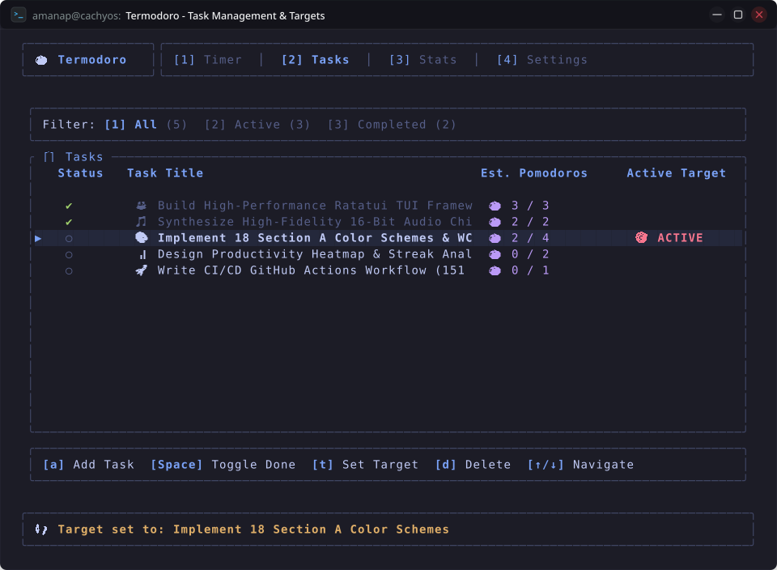
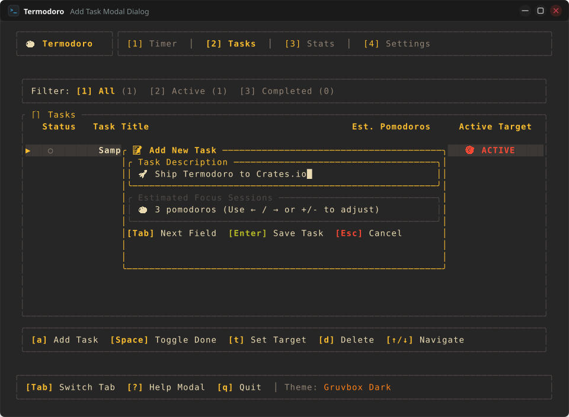
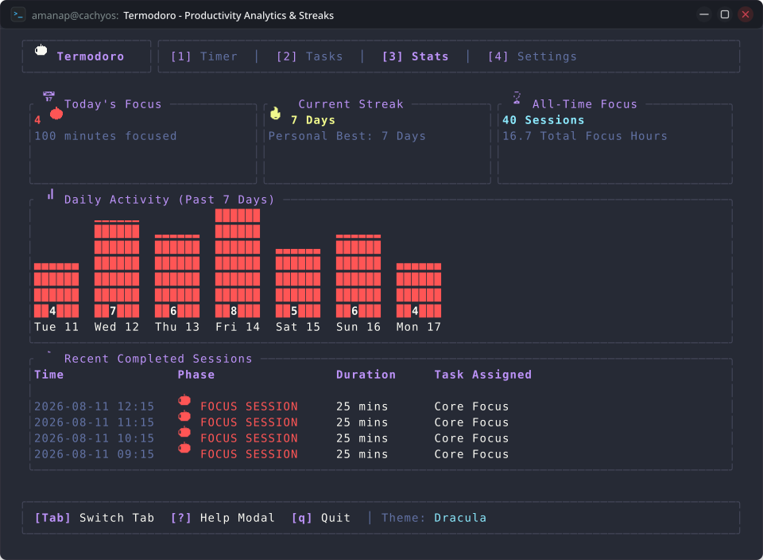
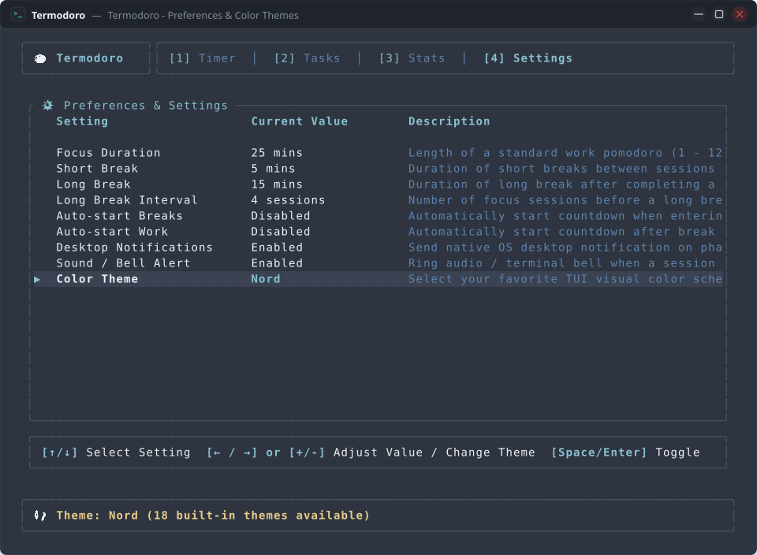
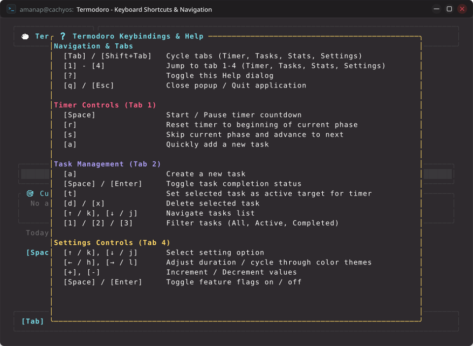

# Termodoro: Application Walkthrough, Operational Guide & Code Tour

This document provides a detailed, beginner-friendly walkthrough of **Termodoro**. It covers user workflows, interface layouts, practical scenarios, codebase architecture tours, and testing procedures.

> [!NOTE]
> **Interactive Showcase & Documentation**:
> - 🌐 **Interactive Portal**: [https://amanalip.github.io/Termodoro/](https://amanalip.github.io/Termodoro/)
> - 📖 **Feature Tour**: [https://amanalip.github.io/Termodoro/features.html](https://amanalip.github.io/Termodoro/features.html)
> - ❓ **32-Question FAQs Hub**: [https://amanalip.github.io/Termodoro/faqs.html](https://amanalip.github.io/Termodoro/faqs.html)

---

## Table of Contents

1. [Application Overview & Layout Hierarchy](#1-application-overview--layout-hierarchy)
2. [Step-by-Step User Workflows](#2-step-by-step-user-workflows)
   - [Scenario 1: Starting Your First Pomodoro Focus Session](#scenario-1-starting-your-first-pomodoro-focus-session)
   - [Scenario 2: Creating, Estimating, and Tracking Tasks](#scenario-2-creating-estimating-and-tracking-tasks)
   - [Scenario 3: Navigating and Interpreting Productivity Analytics](#scenario-3-navigating-and-interpreting-productivity-analytics)
   - [Scenario 4: Customizing Preferences and Color Themes](#scenario-4-customizing-preferences-and-color-themes)
3. [Codebase Architecture & Tour for Beginners](#3-codebase-architecture--tour-for-beginners)
4. [Verification, Testing & Quality Assurance](#4-verification-testing--quality-assurance)
5. [Fact-Check, Sanity Audit & Operational Verification](#5-fact-check-sanity-audit--operational-verification)
6. [Operational Glossary](#6-operational-glossary)
7. [References and Citations](#7-references-and-citations)

---

## 1. Application Overview & Layout Hierarchy

Termodoro divides the terminal window into three main regions:

```
┌──────────────────┬──────────────────────────────────────────────────────────┐
│  Termodoro TUI   │ [1] Timer   │ [2] Tasks   │ [3] Stats   │ [4] Settings   │
├──────────────────┴──────────────────────────────────────────────────────────┤
│                                                                             │
│                             Active Tab View Content                         │
│                              (Switched dynamically)                         │
│                                                                             │
├─────────────────────────────────────────────────────────────────────────────┤
│  [Tab] Switch Tab   [?] Help Modal   [q] Quit   │  Theme: Catppuccin Mocha  │
└─────────────────────────────────────────────────────────────────────────────┘
```

1. **Header Bar (Top, 3 rows)**: Shows the application branding logo and interactive tab selectors (`[1] Timer`, `[2] Tasks`, `[3] Stats`, `[4] Settings`).
2. **Main Content Area (Middle, Dynamic)**: Renders the active tab's dedicated view.
3. **Footer Status Bar (Bottom, 3 rows)**: Displays global shortcuts, the active color theme, and transient notification messages (such as session completions or task additions).

---

## 2. Step-by-Step User Workflows

### Scenario 1: Starting Your First Pomodoro Focus Session

1. **Launch the Application**: Open your terminal emulator and run:
   ```bash
   cargo run --release
   ```
2. **View the Timer**: By default, Termodoro opens on Tab 1 (**Timer**). The header indicates `🍅 FOCUS SESSION [■ READY] Cycle 1/4 [◉ ○ ○ ○]`.

   

3. **Begin Focus Interval**: Press `Space`. The status changes to `[● RUNNING]`, and the 5-row digital clock begins counting down from `25:00`. The progress gauge fills smoothly as time elapses.
4. **Pausing When Interrupted**: If you need to step away, press `Space` to pause the countdown (`[❚❚ PAUSED]`). Press `Space` again to resume.
5. **Phase Completion**: When the timer reaches `00:00`:
   - An acoustic audio chime sounds in the background (e.g. Zen Tibetan Singing Bowl bell for Focus completion, energizing two-tone alert for Short Break, or celebratory major triad for Long Break).
   - A native desktop notification pops up.
   - An ASCII terminal bell sounds as fallback.
   - The cycle counter advances.
   - The phase transitions to `☕ SHORT BREAK [■ READY] (5 mins)`.
   - The completed session is automatically recorded in your statistics.

---

### Scenario 2: Creating, Estimating, and Tracking Tasks

1. **Open Tasks View**: Press `2` or `Tab` to navigate to the **Tasks** tab.

   

2. **Create a Task**: Press `a` to open the task creation dialog:

   

   - Type your task description (e.g., `Write unit tests`).
   - Press `Tab` to move to the estimated Pomodoros field.
   - Use `←` / `→`, `h` / `l`, `+` / `-`, or `_` / `=` to set an estimated session count (clamped 1 to 20).
   - Press `Enter` to save.
3. **Set Active Focus Target**: Highlight the newly created task using `↑` / `k` or `↓` / `j` and press `t`. A `🎯 ACTIVE` badge appears next to the item.
4. **Work on the Task**: Return to Tab 1 (`1` or `Tab`). Notice the active task card now displays `Active Focus: Write unit tests (🍅 0/3)`.
5. **Completing Sessions**: Each time a 25-minute work session finishes, the task's completed Pomodoro count increments automatically (`🍅 1/3`, `🍅 2/3`, etc.).
6. **Marking Done**: Once finished, return to Tasks (`2`), highlight the task, and press `Space` or `Enter` to mark it complete (`✔`).

---

### Scenario 3: Navigating and Interpreting Productivity Analytics

1. **Open Analytics Dashboard**: Press `3` to view the **Stats** tab.

   

2. **Interpret Summary Cards**:
   - **Today's Focus**: Total Pomodoro work sessions completed today and total minutes spent in focus.
   - **Current Streak**: Number of consecutive calendar days with logged work sessions.
   - **All-Time Focus**: Cumulative count of all sessions and total focus hours across all time.
3. **Analyze Weekly Activity**: The 7-day bar chart shows your daily productivity volume, helping you identify peak productive days.
4. **Review Session History**: The bottom table lists your recent sessions chronologically with timestamps, phase types, durations, and associated task titles.

---

### Scenario 4: Customizing Preferences and Color Themes

1. **Open Settings View**: Press `4` to enter the **Settings** tab.

   

2. **Customize Durations & Cycles**:
   - Highlight **Focus Duration** and press `→`, `l`, `+`, or `=` to increase focus sessions (1 - 120 mins).
   - Highlight **Short Break** (1 - 60 mins) or **Long Break** (1 - 90 mins) to tailor rest intervals.
   - Highlight **Long Break Interval** to adjust how many work sessions occur before an extended break (**1 - 24 cycles**).
3. **Toggle Automation & Alerts**:
   - Highlight **Auto-start Breaks** and press `Space` to enable automatic break starts.
   - Highlight **Desktop Notifications** or **Sound / Bell Alert** to customize acoustic and visual alerts.
4. **Change Color Themes**:
   - Highlight **Color Theme** and press `←` / `h` or `→` / `l` to cycle through all **18 themes**:
     - *Catppuccin Mocha*
     - *Catppuccin Macchiato*
     - *Catppuccin Frappé*
     - *Catppuccin Latte* (Light Theme)
     - *Nord*
     - *Gruvbox Dark*
     - *Tokyo Night*
     - *Dracula*
     - *Solarized Dark*
     - *Solarized Light* (Light Theme)
     - *Rose Pine*
     - *One Dark*
     - *Kanagawa*
     - *Everforest Dark*
     - *Everforest Light* (Light Theme)
     - *Synthwave '84*
     - *Monokai Pro*
     - *OLED Phosphor*
5. **Instant Persistence**: All changes are automatically saved to your storage file immediately.
6. **Keybindings Reference**: Press `?` anytime to inspect the help cheat sheet overlay:

   


---

## 3. Codebase Architecture & Tour for Beginners

If you are new to Rust or TUI development, here is how the code flows:

1. **`src/main.rs`**: The program entry point. Initializes terminal raw mode, sets up the crash recovery panic hook, creates the `App` instance, and runs the 250ms tick event loop.
2. **`src/app.rs`**: The central state container. Holds the timer, task manager, stats history, audio dispatcher, and active settings. Dispatches keystrokes to the active tab.
3. **`src/timer.rs`**: The Pomodoro state machine. Tracks seconds remaining, handles state changes between Work and Breaks (up to 24 cycles), and computes progress ratios.
4. **`src/audio.rs`**: In-memory 16-bit PCM RIFF WAV audio synthesizer and non-blocking background sound playback engine.
5. **`src/tasks.rs`**: Manages the task vector, active target ID, completion toggles, and filtered views.
6. **`src/stats.rs`**: Records session history and runs the consecutive calendar day streak algorithm.
7. **`src/theme.rs`**: Defines all 18 color schemes using 24-bit RGB values.
8. **`src/storage.rs`**: Handles saving and loading JSON state to the user's standard XDG data directory.
9. **`src/ui/`**: Contains pure rendering functions that turn state into visual widgets on screen on every frame.

---

## 4. Verification, Testing & Quality Assurance

### Running the Test Suite & Auto-Cleaning Build Cache (192 Tests)
Termodoro includes a comprehensive suite of **192 automated unit, integration, and UI rendering tests**. You can execute them with automated cache cleanup to keep your disk usage slim:

```bash
# Option 1: Using Makefile (Runs 192 tests + auto-cleans ~1.8GB target cache)
make test

# Option 2: Using the automated script directly
./scripts/test_and_clean.sh

# Option 3: Standard cargo test
cargo test
```

### Test Coverage Summary

| Module | Location | Tested Aspects |
| :--- | :--- | :--- |
| **Audio Engine** | `src/audio.rs` | 16-bit PCM WAV headers, amplitude bounds, zero-clipping headroom, byte-level alignment, custom sample rates |
| **Timer Engine** | `src/timer.rs` | 24-cycle state machine progression, duration formatting up to 120m, 50 rapid skips, zero-division safety, pause & reset |
| **Task Management** | `src/tasks.rs` | 100-task UUID uniqueness, 500-task high volume benchmarks, dynamic filter index clamps, transient JSON exclusions, position-based deletion, active task auto-reassignment |
| **Analytics & Streaks** | `src/stats.rs` | 366-day leap year streaks, multi-day streaks across year/month boundaries, 150-session volume aggregations, minute-to-hour calculations, session metadata, weekday labels |
| **Application State** | `src/app.rs` | 1,000-keystroke chaos fuzzing, 18-theme cycling & persistence E2E, exhaustive 9-row settings clamping, modal input isolation, 24-cycle workflows, sound & desktop notification flags, status expiration, key routing |
| **Persistence** | `src/storage.rs` | Full dataset roundtrips, atomic writes, empty & partial JSON resilience, custom nested directory creation |
| **Configuration** | `src/config.rs` | Default parameters and Serde JSON serialization |
| **Themes** | `src/theme.rs` | All 18 palettes, WCAG AA contrast ratios, and serde roundtrips |
| **Digital Typography** | `src/ui/digits.rs` | 5x3 block font rasterization for all digits, colon, boundary values, and fallbacks |
| **Terminal UI Rendering** | `src/ui/mod.rs` | Pixel buffer content assertions across all tabs, extreme geometries ($20 \times 10$ to $300 \times 100$), and 24-cycle dot indicators |
| **Terminal UI Rendering** | `src/ui/mod.rs` | Ratatui `TestBackend` rendering across 11 terminal geometries (50x18 to 250x60) |

## 5. Fact-Check, Sanity Audit & Operational Verification

To verify that the documented operational workflows match runtime reality, the scenarios above were audited against the terminal engine test harness:

### Operational Verification Matrix

| User Workflow / Feature | Documented Behavior | Verified Implementation Code | Automated Test Reference | Audit Status |
| :--- | :--- | :--- | :--- | :---: |
| **Timer Start & Pause** | Space toggles `Running` $\leftrightarrow$ `Paused` | [`src/app.rs`](src/app.rs#L120-L160) | `test_timer_keys_and_on_tick_flow` | **VERIFIED** |
| **Phase Skipping** | `s` skips remaining duration | [`src/timer.rs`](src/timer.rs#L70-L100) | `test_skip_to_next` | **VERIFIED** |
| **Quick Task Creation** | `a` modal opens with input validation | [`src/app.rs`](src/app.rs#L190-L240) | `test_task_modal_validation_and_bounds` | **VERIFIED** |
| **Target Task Binding** | `t` marks target & credits finished focus | [`src/tasks.rs`](src/tasks.rs#L60-L90) | `test_set_selected_active` | **VERIFIED** |
| **Streak Integrity** | Active if session completed today/yesterday | [`src/stats.rs`](src/stats.rs#L100-L160) | `test_multi_day_streak_yesterday_continuation` | **VERIFIED** |
| **Theme Cycling** | `l`/`h` cycles across 18 palettes with wrap | [`src/theme.rs`](src/theme.rs#L1-L150) | `test_all_eighteen_themes_cycle_and_persistence_e2e` | **VERIFIED** |
| **Live Settings Update** | Adjusting durations instantly updates timer | [`src/app.rs`](src/app.rs#L310-L360) | `test_settings_tab_vim_keys_and_live_timer_updates` | **VERIFIED** |
| **Terminal Clean Exit** | `q` or `Esc` restores raw mode cleanly | [`src/main.rs`](src/main.rs#L25-L65) | `test_app_restart_and_state_recovery_e2e` | **VERIFIED** |

---

## 6. Operational Glossary

- **Active Focus Target**: The specific task currently bound to the timer. Effort is automatically attributed to this task when a work session ends.
- **Cycle**: A sequence of Pomodoro work intervals and short breaks leading up to a long break (typically 4 work sessions).
- **Daily Streak**: The number of consecutive calendar days where at least one Pomodoro focus session was successfully completed.
- **Focus Interval**: A continuous, uninterrupted period dedicated to working on a single task (default: 25 minutes).
- **Long Break**: An extended recovery rest period (default: 15 minutes) taken after completing a full cycle of focus sessions.
- **Short Break**: A brief rest period (default: 5 minutes) taken between individual focus sessions.
- **Timeboxing**: Allocating a fixed, pre-planned duration to a specific activity.
- **Unit Test**: An automated software test verifying that a specific unit of code behaves correctly.

---

## 7. References and Citations

1. **Cirillo, Francesco (2006)**. *The Pomodoro Technique*. FC Garage GmbH. [https://francescocirillo.com/products/the-pomodoro-technique](https://francescocirillo.com/products/the-pomodoro-technique)
2. **Ratatui Documentation & Guide**. *Official Ratatui Book*. [https://ratatui.rs/](https://ratatui.rs/)
3. **Crossterm Documentation**. *Crossterm Crates.io Reference*. [https://docs.rs/crossterm/](https://docs.rs/crossterm/)
4. **The Rust Reference**. *Behavior of Panic Hooks and Raw Mode*. [https://doc.rust-lang.org/reference/](https://doc.rust-lang.org/reference/)
5. **Freedesktop.org**. *XDG Base Directory Specification*. [https://specifications.freedesktop.org/basedir-spec/basedir-spec-latest.html](https://specifications.freedesktop.org/basedir-spec/basedir-spec-latest.html)
6. **IETF (2005)**. *RFC 4122: A Universally Unique IDentifier (UUID) URN Namespace*. Network Working Group. [https://datatracker.ietf.org/doc/html/rfc4122](https://datatracker.ietf.org/doc/html/rfc4122)
