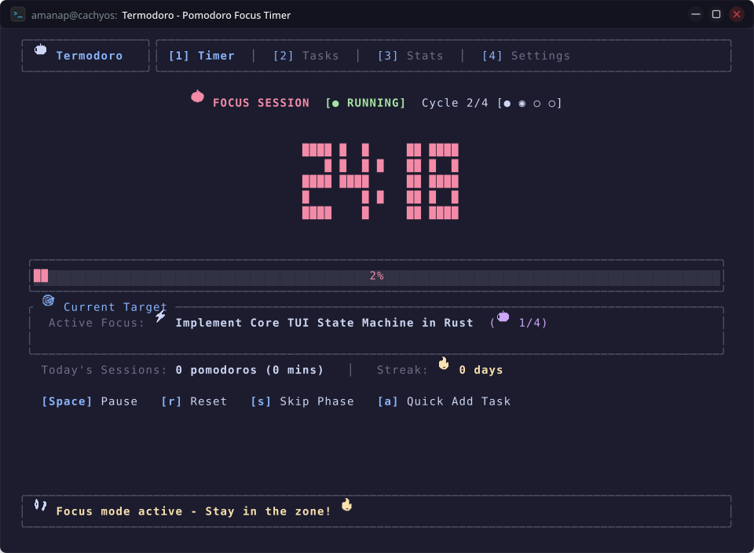

# User Journey 01: Core Pomodoro Focus Session & Interval Cycling

Master your daily workflow with **Termodoro**'s primary operational loop: running distraction-free focus intervals, handling interruptions smoothly, progressing across multi-cycle intervals, and resting with acoustic notifications.

---

## Table of Contents

1. [Journey Overview & Persona Context](#1-journey-overview--persona-context)
2. [Step-by-Step Interactive Walkthrough](#2-step-by-step-interactive-walkthrough)
   - [Step 1: Launching into the Focus Workstation](#step-1-launching-into-the-focus-workstation)
   - [Step 2: Starting the Countdown Timer](#step-2-starting-the-countdown-timer)
   - [Step 3: Handling Pauses & Reset Recovery](#step-3-handling-pauses--reset-recovery)
   - [Step 4: Completing a Work Phase & Acoustic Chimes](#step-4-completing-a-work-phase--acoustic-chimes)
   - [Step 5: Taking a Restorative Short Break](#step-5-taking-a-restorative-short-break)
   - [Step 6: Progressing Through 4 Cycles to the Long Break](#step-6-progressing-through-4-cycles-to-the-long-break)
3. [Visual Layout & Interface Details](#3-visual-layout--interface-details)
4. [Under the Hood: Engineering & Logic Architecture](#4-under-the-hood-engineering--logic-architecture)
5. [Pro Tips & Power Workflows](#5-pro-tips--power-workflows)
6. [Complete Keybinding Reference](#6-complete-keybinding-reference)

---

## 1. Journey Overview & Persona Context

Whether you are an engineer implementing a database migration, a student writing a thesis, or a researcher analyzing experimental data, modern computing environments are filled with constant interruptions: chat notifications, background browser processes, and notification banners.

This user journey demonstrates how a practitioner uses Termodoro directly in a terminal tab to maintain a deep focus flow state:

```
[Launch Termodoro] ──> [Work: 25m Countdown] ──> [Zen 528Hz Chime] ──> [Short Break: 5m] ──> [Repeat 4 Cycles] ──> [Long Break: 15m]
```

---

## 2. Step-by-Step Interactive Walkthrough

### Step 1: Launching into the Focus Workstation
Open your terminal emulator and launch Termodoro:

```bash
termodoro
```

Termodoro boots instantaneously in less than **10 milliseconds**, presenting **Tab 1: Timer View**.
- The large 5-row digital block clock is initialized at `25:00` (driven by [`src/timer.rs`](../src/timer.rs)).
- The cycle counter shows `Cycle 1/4`.
- The status indicator displays `[STOPPED]`.

---

### Step 2: Starting the Countdown Timer
- Press `Space` to initiate the focus block.
- The status switches to `[RUNNING]` via `PomodoroTimer::toggle()`.
- The clock smoothly decrements every second in the 100ms event loop (`src/main.rs`), while the progress gauge at the bottom fills proportionally.
- You can minimize the terminal or send it to the background; Termodoro calculates remaining time with monotonic timestamp precision.

---

### Step 3: Handling Pauses & Reset Recovery
- **Need a quick pause?** Press `Space` to pause the countdown. The badge shifts to `[PAUSED]`.
- **Ready to resume?** Press `Space` again to pick up exactly where you left off.
- **Want a clean slate?** Press `r` to reset the active interval back to `25:00` via `PomodoroTimer::reset()`.
- **Need to skip ahead?** Press `s` to immediately conclude the current phase and step to the next interval via `PomodoroTimer::skip_to_next()`.

---

### Step 4: Completing a Work Phase & Acoustic Chimes
When the countdown reaches `00:00`, Termodoro triggers its built-in feedback pipeline:
1. 🎵 **Zen Tibetan Singing Bowl**: Synthesizes a 528 Hz transformation frequency with overtone harmonics (1056 Hz and 1584 Hz) and exponential decay (`src/audio.rs:49-72`).
2. 🔔 **Desktop Notification**: An OS native banner appears via D-Bus / Desktop Portal / WinRT (*"Termodoro - FOCUS SESSION Finished!"*).
3. 🍅 **Automated Accounting**: If an active task is selected, its spent Pomodoro counter increments automatically (`🍅 1 / 4`), and 25 focus minutes are logged to your permanent analytics history (`src/stats.rs`).
4. 🔄 **State Transition**: The phase automatically shifts to **SHORT BREAK** (5:00).

---

### Step 5: Taking a Restorative Short Break
- Press `Space` to begin your 5-minute break.
- Step away from your keyboard, hydrate, or stretch.
- When 5 minutes elapse, an uplifting double-chime ($D_5\text{ 587.33 Hz} \rightarrow A_5\text{ 880.0 Hz}$) signals that break time is over and readies you for Cycle 2.

---

### Step 6: Progressing Through 4 Cycles to the Long Break
As you complete successive sessions, the cycle progress indicators update dynamically:
- Cycle 1: `● ○ ○ ○` (1 focus block finished)
- Cycle 2: `● ● ○ ○` (2 focus blocks finished)
- Cycle 3: `● ● ● ○` (3 focus blocks finished)
- Cycle 4: `● ● ● ●` (4 focus blocks finished)

Upon finishing the 4th session, Termodoro automatically enters a **15-minute Long Break** with a rich major triad chord ($C_5\text{ 523.25 Hz} \rightarrow E_5\text{ 659.25 Hz} \rightarrow G_5\text{ 783.99 Hz}$), providing deep mental restoration before resetting the cycle counter back to 1.

---

## 3. Visual Layout & Interface Details

Below is the live operational layout of Tab 1 during an active focus session:



### Anatomy of Tab 1:
1. **Header Navigation Bar**: Highlights active tab `1: Timer` along with quick access to `2: Tasks`, `3: Stats`, and `4: Settings`.
2. **Big Block Clock**: 5-row rasterized ASCII block numerals (`█`) dynamically generated by `src/ui/digits.rs`.
3. **Phase Badge**: Color-coded indicator displaying current mode (`🍅 FOCUS SESSION`, `☕ SHORT BREAK`, `🌴 LONG BREAK`).
4. **Cycle Progress Tracker**: Visual dot matrix (`● ● ○ ○`) tracking your progress toward the Long Break.
5. **Active Task Card**: Displays the title, progress (`🍅 2 / 4`), and estimation metrics of your currently bound target task.
6. **Progress Gauge**: Real-time progress bar rendering completion percentage.
7. **Status & Notification Footer**: Live keybinding helpers and real-time confirmation banners.

---

## 4. Under the Hood: Engineering & Logic Architecture

- **Sub-Second Tick Accuracy**: In [`src/timer.rs`](../src/timer.rs), ticks are processed on a 100ms interval loop. Time remaining calculation avoids integer underflow with saturating subtraction.
- **Pure In-Memory Audio**: Audio is not loaded from `.wav` files. Sample buffers are generated mathematically into standard 16-bit PCM RIFF WAV headers in `std::io::Cursor` and decoded via `rodio` on a dedicated background thread.
- **Terminal Raw Mode Protection**: A custom panic hook in `src/main.rs` guarantees the terminal raw mode and alternate screen buffer are restored even if the process crashes.

---

## 5. Pro Tips & Power Workflows

> [!TIP]
> **Floating Window Multiplexer Setup**: Keep Termodoro floating over your editor in `tmux` or `zellij`:
> ```bash
> # Zellij floating popup
> zellij run --floating --width 80% --height 80% -- termodoro
> ```

> [!NOTE]
> **Auto-Start Automation**: If you prefer automatic transitions without pressing `Space` after each break, navigate to **Settings (Tab 4)** and toggle **Auto-start Breaks** and **Auto-start Pomodoros** to `[Enabled]`.

---

## 6. Complete Keybinding Reference

| Keybinding | Action | Codebase Handler & Behavior |
| :---: | :--- | :--- |
| `Space` | **Start / Pause** | [`src/app.rs:468`](../src/app.rs#L468) (`timer.toggle()`) |
| `r` | **Reset** | [`src/app.rs:473`](../src/app.rs#L473) (`timer.reset()`) |
| `s` | **Skip** | [`src/app.rs:480`](../src/app.rs#L480) (`timer.skip_to_next()`) |
| `a` | **Quick Add Task** | [`src/app.rs:487`](../src/app.rs#L487) (`open_task_modal()`) |
| `1` - `4` | **Switch Tab** | [`src/app.rs:288-311`](../src/app.rs#L288-L311) (`active_tab = ActiveTab::...`) |
| `Tab` / `Shift+Tab` | **Cycle Tabs** | [`src/app.rs:268-286`](../src/app.rs#L268-L286) (`next_tab()` / `previous_tab()`) |
| `?` | **Help Overlay** | [`src/app.rs:261`](../src/app.rs#L261) (`show_help = true`) |
| `q` | **Quit** | [`src/app.rs:254`](../src/app.rs#L254) (`should_quit = true`) |
