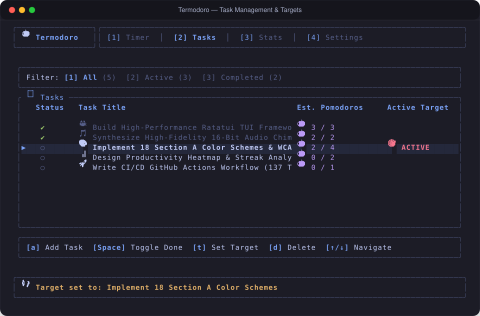
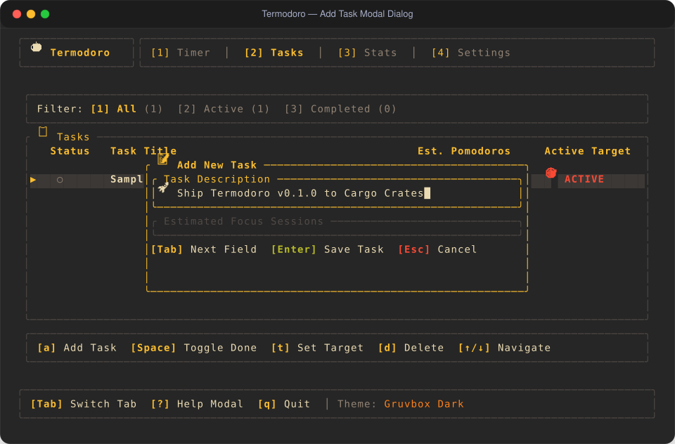

# User Journey 02: Task Creation, Estimation & Target Tracking

Organize your projects, estimate effort in discrete Pomodoro blocks, bind active target tasks to your timer, and track completed workload with **Termodoro**'s interactive Task Manager.

---

## Table of Contents

1. [Journey Narrative & Persona](#1-journey-narrative--persona)
2. [Step-by-Step Interactive Walkthrough](#2-step-by-step-interactive-walkthrough)
   - [Step 1: Navigating to the Tasks Workstation](#step-1-navigating-to-the-tasks-workstation)
   - [Step 2: Creating a New Task via Modal Dialog](#step-2-creating-a-new-task-via-modal-dialog)
   - [Step 3: Setting an Active Target Task](#step-3-setting-an-active-target-task)
   - [Step 4: Real-Time Focus Binding & Automatic Effort Logging](#step-4-real-time-focus-binding--automatic-effort-logging)
   - [Step 5: Filtering Views & Toggling Completion](#step-5-filtering-views--toggling-completion)
   - [Step 6: Adjusting Estimates & Task Pruning](#step-6-adjusting-estimates--task-pruning)
3. [Visual Layout & Interface Deep Dive](#3-visual-layout--interface-deep-dive)
4. [Pro Tips & Power Workflows](#4-pro-tips--power-workflows)
5. [Complete Keybinding Reference](#5-complete-keybinding-reference)

---

## 1. Journey Narrative & Persona

> **Meet Maya, a Full-Stack Engineer and Technical Lead.**  
> Maya starts her morning planning today's goals: writing API documentation, fixing a caching race condition, and conducting two PR reviews. Instead of opening a heavy browser-based project board, Maya organizes her work directly in Termodoro by estimating each item in 25-minute Pomodoro intervals.

---

## 2. Step-by-Step Interactive Walkthrough

### Step 1: Navigating to the Tasks Workstation
From anywhere in Termodoro, press `2` (or press `Tab`) to navigate to **Tab 2: Tasks View**.

---

### Step 2: Creating a New Task via Modal Dialog
1. Press `a` (or `n`) to bring up the **New Task Modal**.
2. Type your task title (e.g., `⚡ Refactor Storage Engine with Zero-Telemetry Invariants`).
3. Press `Tab` or `↓` to move focus to the **Estimated Pomodoros** input field.
4. Enter your estimated effort in Pomodoro blocks (e.g., `3`).
5. Press `Enter` to commit the task. (Press `Esc` anytime to cancel).

---

### Step 3: Setting an Active Target Task
1. Use `j` / `k` (or `↑` / `↓` arrow keys) to navigate through your task list.
2. Press `t` on a selected task.
3. A glowing `🎯 [ACTIVE]` badge instantly appears on the row, and a confirmation banner alerts: *"Target set to: ⚡ Refactor Storage Engine..."*.
4. Switch to **Tab 1 (`1`)**: Notice the task is now pinned in the prominent active target card directly beneath the big digital countdown clock!

---

### Step 4: Real-Time Focus Binding & Automatic Effort Logging
- Start your focus timer on Tab 1 with `Space`.
- When the 25-minute session completes, Termodoro automatically increments the active task's spent counter: `🍅 1 / 3` $\rightarrow$ `🍅 2 / 3`.
- Once `pomodoros_spent >= pomodoros_estimated`, the counter dynamically shifts from primary theme color to amber/green, signaling that your estimated threshold has been reached.

---

### Step 5: Filtering Views & Toggling Completion
- When you finish an objective, highlight the task on Tab 2 and press `Space` (or `Enter`) to toggle its checkbox (`[ ]` $\rightarrow$ `[x]`).
- Press `1`, `2`, or `3` while on the Tasks tab to switch filter views:
  - **`1` (All Tasks)**: Shows everything in your backlog.
  - **`2` (Active Only)**: Hides completed items for a clean, distraction-free view.
  - **`3` (Completed Only)**: Displays finished items for end-of-day retrospectives and standup notes.

---

### Step 6: Adjusting Estimates & Task Pruning
- Underestimated a tricky bug? When creating a task in the modal, adjust Pomodoros via `+` / `-` or direct digits `1` - `9`.
- Completed or obsolete task? Press `d` (or `x`) on Tab 2 to remove it. If you delete the currently active target task, Termodoro gracefully unbinds the target without breaking timer state.

---

## 3. Visual Layout & Interface Deep Dive

### Interactive Tasks Table View

### Task Creation Modal Dialog

### Tasks View Components:
1. **Filter Selector Bar**: Visual badges showing `[● All (1)]`, `[  Active (2)]`, `[  Completed (3)]`.
2. **Interactive Table Rows**:
   - **Status Checkbox**: `[ ]` (Pending) or `[x]` (Completed).
   - **Active Badge**: `🎯 [ACTIVE]` indicating timer binding.
   - **Task Title**: Left-aligned with automatic Unicode truncation on narrow screens.
   - **Pomodoro Counters**: Visual emoji counter (`🍅 2 / 3`).
3. **Modal Input Overlay**: Dual-field dialog with high-visibility input cursors and validation bounds.

---

## 4. Pro Tips & Power Workflows

> [!TIP]
> **Quick Add from Timer View**: You don't need to switch tabs to add a task! Press `a` while on Tab 1 (Timer View) to pop up the task creation modal instantly.

> [!IMPORTANT]
> **Atomic Persistence**: Every task edit, completion toggle, and target change is saved immediately to `~/.local/share/termodoro/data.json` with zero risk of state loss upon closing.

---

## 5. Complete Keybinding Reference

| Keybinding | Action | Context / Behavior |
| :---: | :--- | :--- |
| `j` / `↓` | **Select Next** | Move selection cursor down |
| `k` / `↑` | **Select Previous** | Move selection cursor up |
| `a` | **Add Task** | Open task creation modal overlay |
| `Space` / `Enter` | **Toggle Done** | Toggle completion checkmark (`[ ]` / `[x]`) |
| `t` | **Set Active Target** | Bind highlighted task to countdown timer |
| `d` / `x` | **Delete Task** | Remove highlighted task permanently |
| `1` | **Filter: All** | Display all tasks in the list |
| `2` | **Filter: Active** | Display only uncompleted tasks |
| `3` | **Filter: Completed** | Display only finished tasks |
| `Tab` / `BackTab` | **Switch Tabs** | Cycle across Timer, Tasks, Stats, and Settings |
| `?` | **Help Overlay** | View global keybinding reference dialog |
| `q` / `Esc` | **Quit** | Save state and exit application |
