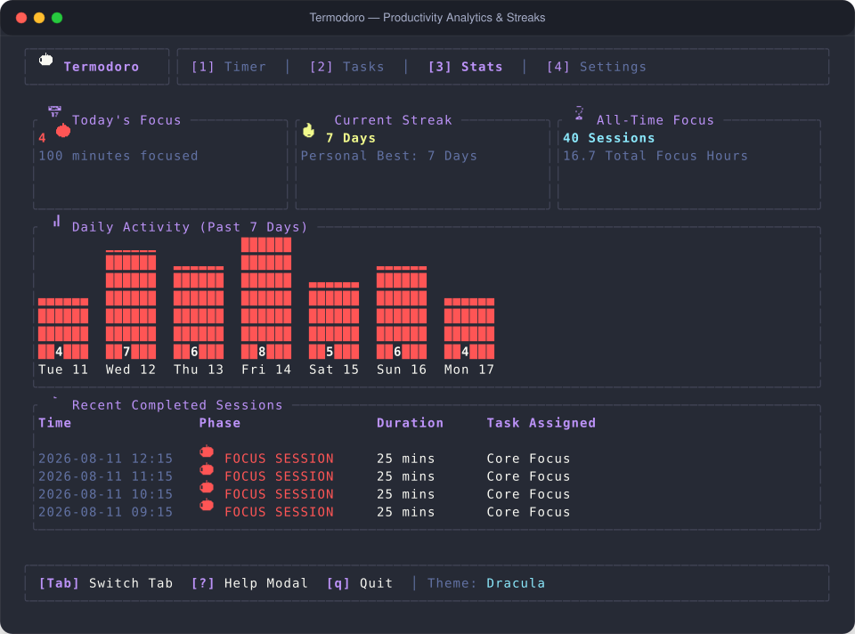

# User Journey 03: Analytics, Daily Streaks & Productivity Insights

Track your focus metrics, analyze 7-day productivity distribution charts, preserve multi-day habit streaks across calendar boundaries, and inspect your session activity logs in **Termodoro**.

---

## Table of Contents

1. [Journey Overview & Persona Context](#1-journey-overview--persona-context)
2. [Step-by-Step Interactive Walkthrough](#2-step-by-step-interactive-walkthrough)
   - [Step 1: Navigating to the Analytics Workstation](#step-1-navigating-to-the-analytics-workstation)
   - [Step 2: Inspecting Quantitative Metric Cards](#step-2-inspecting-quantitative-metric-cards)
   - [Step 3: Analyzing the 7-Day Activity Distribution Histogram](#step-3-analyzing-the-7-day-activity-distribution-histogram)
   - [Step 4: Building & Preserving Consecutive Day Streaks](#step-4-building--preserving-consecutive-day-streaks)
   - [Step 5: Reviewing the Chronological Session Activity Log](#step-5-reviewing-the-chronological-session-activity-log)
3. [Visual Layout & Interface Deep Dive](#3-visual-layout--interface-deep-dive)
4. [Under the Hood: Streak Algorithms & Mathematical Guarantees](#4-under-the-hood-streak-algorithms--mathematical-guarantees)
5. [Complete Keybinding Reference](#5-complete-keybinding-reference)

---

## 1. Journey Overview & Persona Context

Sustainable focus requires feedback and habit momentum. Long-term productivity is built on continuous daily discipline rather than sporadic bursts of overwork.

This user journey demonstrates how a practitioner tracks their daily output, monitors weekly distribution cadence, and maintains habit streaks with Termodoro's local analytics engine:

```
[Complete Focus Sessions] ──> [Log Duration & Task ID] ──> [Update Consecutive Daily Streaks] ──> [Inspect 7-Day Histogram]
```

---

## 2. Step-by-Step Interactive Walkthrough

### Step 1: Navigating to the Analytics Workstation
From any tab in Termodoro, press `3` (or press `Tab`) to jump directly into **Tab 3: Stats View**.

---

### Step 2: Inspecting Quantitative Metric Cards
The top metrics banner gives you an instantaneous summary of your focus output:

1. ⏱️ **Total Focus Time**: Cumulative focused work time formatted as hours and minutes (e.g., `42h 30m` or `125m` via `StatsHistory::total_focus_minutes()`).
2. 🍅 **Total Pomodoros**: Exact count of fully completed 25-minute focus intervals via `StatsHistory::total_work_sessions()`.
3. 🔥 **Current Streak**: Number of consecutive calendar days where at least one focus session was completed (`StatsHistory::current_streak_days()`).
4. 🏆 **Longest Streak**: Your all-time personal best continuous daily streak record (`StatsHistory::longest_streak_days()`).

---

### Step 3: Analyzing the 7-Day Activity Distribution Histogram
The middle panel renders a vertical ASCII bar chart visualizing your focus output over the last 7 calendar days:
- **X-Axis**: Local calendar dates with day of the week labels (`Mon 11`, `Tue 12`, `Wed 13`, `Thu 14`, etc.).
- **Y-Axis**: Proportional vertical bars (`█`) representing total focus minutes or completed Pomodoros on that day via `StatsHistory::last_days_distribution(7)`.
- Allows you to easily spot mid-week productivity peaks and balance your workload across days.

---

### Step 4: Building & Preserving Consecutive Day Streaks
Termodoro's streak tracker motivates continuous daily discipline:
- Complete at least **one** focus session on any calendar day to maintain your streak.
- If you worked yesterday, your streak is preserved and increments automatically as soon as today's first session concludes.
- If you skip a full 24-hour day, the streak resets gracefully to 1 on your next session, while your **Longest Streak** milestone is permanently locked in.

---

### Step 5: Reviewing the Chronological Session Activity Log
The bottom panel displays an activity history table detailing your recent sessions in reverse chronological order:
- **Timestamp**: Local completion time (`14:25 UTC` / `09:30 Local`).
- **Phase & Length**: Mode and duration logged (`Work (25m)`).
- **Target Task**: Title of the specific task associated with the session (e.g. `[⚡ Refactor Storage Engine]`).

---

## 3. Visual Layout & Interface Deep Dive

Below is the live operational layout of Tab 3:



### Key Analytics Layout Elements:
1. **Summary Cards Header**: 4 bordered visual blocks showing Focus Time, Pomodoros, Current Streak, and Personal Best.
2. **Weekly Bar Chart**: High-contrast Unicode bar columns (`█`) calibrated dynamically to your weekly maximum output.
3. **Session History Table**: Timestamped audit trail showing session attribution and durations.

---

## 4. Under the Hood: Streak Algorithms & Mathematical Guarantees

In [`src/stats.rs`](file:///home/amanap/Documents/GitHub/Termodoro/src/stats.rs), the analytics engine guarantees mathematical correctness across calendar boundaries:
- **`distinct_work_dates()`**: Normalizes all completed session timestamps into local dates (`chrono::Local.date_naive()`), deduplicating multiple sessions on the same calendar day.
- **Consecutive Day Continuity**: Backward iteration using `NaiveDate::pred_opt()` bridges month transitions (Feb 28 $\rightarrow$ Mar 1) and year transitions (Dec 31 $\rightarrow$ Jan 1).
- **366-Day Leap Year Resilience**: Tested against full 366-day leap year histories.
- **Zero Break Contamination**: Sessions with `phase == PomodoroPhase::ShortBreak` or `LongBreak` are filtered out so rest periods never artificially inflate productivity numbers.

---

## 5. Complete Keybinding Reference

| Keybinding | Action | Codebase Handler & Behavior |
| :---: | :--- | :--- |
| `1` | **Switch to Timer** | [`src/app.rs:288`](file:///home/amanap/Documents/GitHub/Termodoro/src/app.rs#L288) (`active_tab = ActiveTab::Timer`) |
| `2` | **Switch to Tasks** | [`src/app.rs:295`](file:///home/amanap/Documents/GitHub/Termodoro/src/app.rs#L295) (`active_tab = ActiveTab::Tasks`) |
| `3` | **Switch to Stats** | [`src/app.rs:302`](file:///home/amanap/Documents/GitHub/Termodoro/src/app.rs#L302) (`active_tab = ActiveTab::Stats`) |
| `4` | **Switch to Settings** | [`src/app.rs:308`](file:///home/amanap/Documents/GitHub/Termodoro/src/app.rs#L308) (`active_tab = ActiveTab::Settings`) |
| `Tab` / `Shift+Tab` | **Cycle Tabs** | [`src/app.rs:268-286`](file:///home/amanap/Documents/GitHub/Termodoro/src/app.rs#L268-L286) (`next_tab()` / `previous_tab()`) |
| `?` | **Help Overlay** | [`src/app.rs:261`](file:///home/amanap/Documents/GitHub/Termodoro/src/app.rs#L261) (`show_help = true`) |
| `q` / `Esc` | **Quit** | [`src/app.rs:254`](file:///home/amanap/Documents/GitHub/Termodoro/src/app.rs#L254) (`should_quit = true`) |
