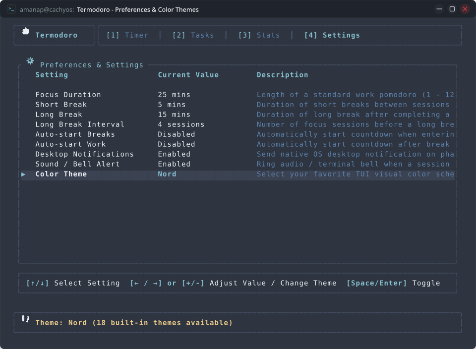
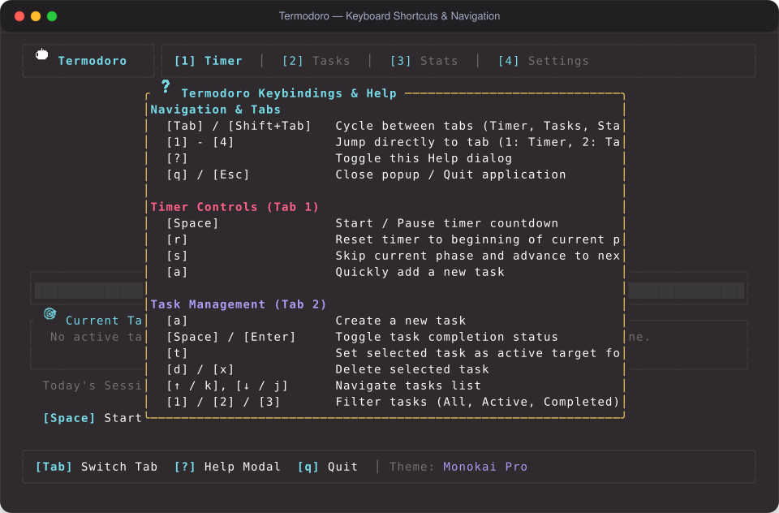

# User Journey 04: Customizing Durations, Acoustic Audio & 18 Color Themes

Personalize your focus environment in **Termodoro**: adjust interval durations, scale long break intervals up to 24 cycles, configure mathematical audio synthesis, and explore 18 handcrafted color themes.

---

## Table of Contents

1. [Journey Overview & Persona Context](#1-journey-overview--persona-context)
2. [Step-by-Step Interactive Walkthrough](#2-step-by-step-interactive-walkthrough)
   - [Step 1: Opening the Live Settings Workstation](#step-1-opening-the-live-settings-workstation)
   - [Step 2: Customizing Focus & Break Interval Durations](#step-2-customizing-focus--break-interval-durations)
   - [Step 3: Scaling the Long Break Cycle Ceiling (Up to 24 Cycles)](#step-3-scaling-the-long-break-cycle-ceiling-up-to-24-cycles)
   - [Step 4: Audio Synthesis & Desktop Notification Toggles](#step-4-audio-synthesis--desktop-notification-toggles)
   - [Step 5: Automated Flow with Auto-Start Transitions](#step-5-automated-flow-with-auto-start-transitions)
   - [Step 6: Real-Time Cycling Across 18 Handcrafted Color Themes](#step-6-real-time-cycling-across-18-handcrafted-color-themes)
3. [Visual Layout & Interface Deep Dive](#3-visual-layout--interface-deep-dive)
4. [Complete 18-Theme Palette Catalog](#4-complete-18-theme-palette-catalog)
5. [Under the Hood: Real-Time Configuration Architecture](#5-under-the-hood-real-time-configuration-architecture)
6. [Complete Keybinding Reference](#6-complete-keybinding-reference)

---

## 1. Journey Overview & Persona Context

Different working styles require different timer cadences and visual aesthetics. A developer working in bright daylight might prefer a crisp light theme with 50-minute ultradian rhythm intervals; at night, they might prefer a pure `#000000` pitch-black OLED palette with classic 25/5 intervals.

This user journey demonstrates how a practitioner tunes every aspect of Termodoro in real time without editing configuration files or restarting the app:

```
[Open Settings (Tab 4)] ──> [Tune Durations (1-120m)] ──> [Set Cycles (1-24)] ──> [Toggle Audio/Toasts] ──> [Cycle 18 Themes]
```

---

## 2. Step-by-Step Interactive Walkthrough

### Step 1: Opening the Live Settings Workstation
From any tab in Termodoro, press `4` to enter **Tab 4: Settings View**.

---

### Step 2: Customizing Focus & Break Interval Durations
1. Use `j` / `k` (or `↑` / `↓` arrows) to select duration rows:
   - **Work Duration**: Default 25 min (clamped to $1 \le N \le 120\text{ min}$ in `src/app.rs:627`).
   - **Short Break Duration**: Default 5 min (clamped to $1 \le N \le 60\text{ min}$ in `src/app.rs:640`).
   - **Long Break Duration**: Default 15 min (clamped to $1 \le N \le 90\text{ min}$ in `src/app.rs:653`).
2. Use `h` / `l` (or `Left` / `Right` arrows, `-` / `+`) to increment or decrement the duration.
3. The active countdown clock on Tab 1 immediately recalibrates to your new duration!

---

### Step 3: Scaling the Long Break Cycle Ceiling (Up to 24 Cycles)
- Select row 4: **Long Break Interval**.
- Adjust the number of focus cycles before a Long Break is triggered (clamped from **1 to 24 cycles** in `src/app.rs:666`).
- Tab 1 automatically updates its visual cycle dots (`● ● ○ ○ ...`) to match your exact cycle configuration.

---

### Step 4: Audio Synthesis & Desktop Notification Toggles
- Select **Desktop Notifications** (row 6) or **Sound Enabled** (row 7).
- Press `Space` or `Enter` to toggle `[Enabled]` / `[Disabled]`.
- **Sound Alert**: Generates clean, click-free mathematical PCM WAV audio ($f = 44.1\text{ kHz}$) directly in memory—no sound files or codecs required.
- **Desktop Notifications**: Dispatches native OS notifications that notify you even when your terminal window is minimized.

---

### Step 5: Automated Flow with Auto-Start Transitions
- **Auto-start Breaks** (row 4): Automatically begins the break countdown the moment your focus session completes.
- **Auto-start Work** (row 5): Automatically begins the next focus countdown when your break expires.

---

### Step 6: Real-Time Cycling Across 18 Handcrafted Color Themes
1. Navigate to row 9: **Color Theme**.
2. Press `l` / `Right` or `h` / `Left` to cycle through all 18 palettes (`ThemeChoice::all()` in `src/theme.rs`).
3. The entire terminal user interface instantly repaints with the new palette without restarting the app!
4. Your theme choice is saved automatically to `data.json`.

---

## 3. Visual Layout & Interface Deep Dive

### Live Settings View Editor


### Global Keybinding Reference Modal (`?`)


---

## 4. Complete 18-Theme Palette Catalog

Every theme in Termodoro is handcrafted with balanced WCAG contrast ratios and 24-bit TrueColor RGB values:

| # | Theme Identifier | Aesthetic Style | Accent Highlights |
| :-: | :--- | :--- | :--- |
| **1** | `CatppuccinMocha` | Modern Dark Pastel *(Default)* | Mauve, Peach & Lavender |
| **2** | `CatppuccinMacchiato` | Midtone Dark Pastel | Soft Lavender & Rose |
| **3** | `CatppuccinFrappe` | Low-Glare Soft Dark | Soft Slate Blue & Mauve |
| **4** | `CatppuccinLatte` | Crisp Clean Light Theme | Pastel Sky Blue & Maroon |
| **5** | `Nord` | Arctic Bluish Dark | Frost Cyan & Snow White |
| **6** | `GruvboxDark` | Warm Retro Groove | Warm Amber & Sage Green |
| **7** | `TokyoNight` | Neon Japanese Dark | Neon Blue & Electric Magenta |
| **8** | `Dracula` | High-Contrast Gothic Dark | Vibrant Purple & Cyan |
| **9** | `SolarizedDark` | Low-Contrast Designer Dark | Cyan & Soft Green |
| **10** | `SolarizedLight` | Warm Paper Designer Light | Cyan & Amber Brown |
| **11** | `RosePine` | Atmospheric Rosé & Pine | Rose Water & Gold Accent |
| **12** | `OneDark` | Atom Pro Dark Syntax | Electric Cyan & Spring Green |
| **13** | `Kanagawa` | Japanese Ukiyo-e Wave Dark | Autumn Amber & Wave Teal |
| **14** | `EverforestDark` | Nature-Inspired Organic Dark | Forest Green & Rust Orange |
| **15** | `EverforestLight` | Organic Warm Paper Light | Soft Leaf Green & Earth Brown |
| **16** | `Synthwave84` | Cyberpunk 1984 Laser Neon | Hot Neon Pink & Electric Cyan |
| **17** | `MonokaiPro` | Spectrum Filtered Dark | Sunshine Yellow & Vibrant Red |
| **18** | `OledPhosphor` | Pure Pitch Black #000000 | Classic CRT Phosphor Green |

---

## 5. Under the Hood: Real-Time Configuration Architecture

In [`src/app.rs`](../src/app.rs), configuration changes propagate immediately:
- **Live Timer Reset**: When changing `work_duration_mins` or break durations while the timer is stopped, the active phase timer resets instantly to match the new duration without requiring manual resets.
- **Atomic Persistence**: Every row modification or toggle automatically invokes `self.save_state()` to synchronize with `data.json`.
- **Serde Serialization**: The `Config` struct is fully serializable across all 18 theme choices with backward-compatible defaults.

---

## 6. Complete Keybinding Reference

| Keybinding | Action | Codebase Handler & Behavior |
| :---: | :--- | :--- |
| `j` / `↓` | **Next Setting** | [`src/app.rs:579`](../src/app.rs#L579) (`settings_index += 1`) |
| `k` / `↑` | **Previous Setting** | [`src/app.rs:590`](../src/app.rs#L590) (`settings_index -= 1`) |
| `h` / `←` / `-` | **Decrease / Prev Theme** | [`src/app.rs:606`](../src/app.rs#L606) (`adjust_setting(-1)`) |
| `l` / `→` / `+` | **Increase / Next Theme** | [`src/app.rs:601`](../src/app.rs#L601) (`adjust_setting(1)`) |
| `Space` / `Enter` | **Toggle State** | [`src/app.rs:611`](../src/app.rs#L611) (`toggle_setting()`) |
| `1` - `4` | **Switch Tab** | [`src/app.rs:288-311`](../src/app.rs#L288-L311) (`active_tab = ActiveTab::...`) |
| `Tab` / `Shift+Tab` | **Cycle Tabs** | [`src/app.rs:268-286`](../src/app.rs#L268-L286) (`next_tab()` / `previous_tab()`) |
| `?` | **Help Overlay** | [`src/app.rs:261`](../src/app.rs#L261) (`show_help = true`) |
| `q` / `Esc` | **Quit** | [`src/app.rs:254`](../src/app.rs#L254) (`should_quit = true`) |
